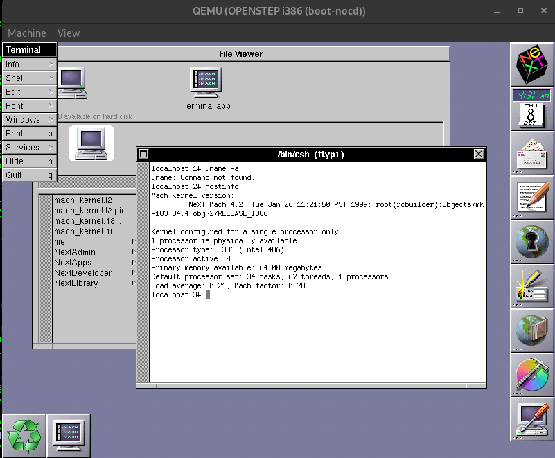

# OPENSTEP Kernel Remade

This project remakes the OPENSTEP 4.2 kernel from its original binaries. The original kernels are the
evidence base: every reconstructed object is compiled with the historical toolchain and compared byte by
byte with the original image.

## Current status (2026-10-08)

**x86: the kernel rebuilt from `07_kernel/` is byte-identical to the original.** All 402 objects are
compiled from the reconstructed sources on an OPENSTEP 4.2 i386 machine with the original compiler
(`cc-744.13`, GCC 2.7.2.1), linked with the Darwin 0.1 kernel link rules and `strip -x`. The result has the
same SHA-256 as the original `mach_kernel` (`33469393…`, 1,117,920 bytes). The QEMU build of that kernel
(the same bytes plus a 12-byte PIC interrupt fix needed by this emulator) boots OPENSTEP 4.2 to the
Workspace, and `hostinfo` reports the original version string.



| Item | Result |
|---|---|
| Recorded objects (with `__text`) | 385: grade A 315 (one A\*), grade P 70 (not an object match: every file-backed section except the listed unverified ones matches in bytes and references; the unverified ones are unreferenced sections or zero-fill placed only through references — `06_reconstruction/README.md`) |
| Data-only objects | 17 (`objects_data.tsv`: syscall table, device switches, protocol tables, `param.c`, version strings, …) |
| Toolchain library members | 2 (`__muldi3`, `__udivdi3` from `/lib/libcc.a`, linked with `-lcc`) |
| `__text` coverage by grade | A 73.13 %, P 26.76 %, L 0.04 %; the remaining 598 bytes are alignment padding |
| Whole-kernel link | identical to the original (`cmp`, SHA-256, symbols 3,751, commons 417) |
| QEMU i386 boot | PIC-fixed build boots to the Workspace (the unmodified build, like the original, locks IDE interrupts in this QEMU; that control boot has not been run) |

The m68k and SPARC kernels have been analysed statically (provenance, Mach-O layout, symbols,
cross-references); their reconstruction has not started.

How to build and use the kernel: [HOWTOCOMPILE.md](HOWTOCOMPILE.md), [HOWTOUSE.md](HOWTOUSE.md).
The plan and the evidence for every step are in [02_plan/RECONSTRUCTION_PLAN.md](02_plan/RECONSTRUCTION_PLAN.md)
and [02_plan/DECISIONS.md](02_plan/DECISIONS.md); per-object evidence is in `06_reconstruction/evidence/`.

## Sources and licences

The project is licensed under the BSD 2-Clause License, except for code taken from the references below,
which keeps its own licence: see [LICENSE](LICENSE).

Reference code is a candidate, not a fact: a reference text is adopted only when the compiled object
matches the original bytes. The reconstructed sources are recorded in
[07_kernel/PROVENANCE.tsv](07_kernel/PROVENANCE.tsv) (origin, revision, path, licence; documents, licence texts and
most generated configuration headers have no row of their own) and changes to reference code are listed in
[07_kernel/MODIFICATIONS.md](07_kernel/MODIFICATIONS.md).

- **NeXTMach** (mk-108.1) — committed with its original notices (decision D013).
- **Darwin 0.1** and **Mach 4** — committed with the notices their files carry (mostly APSL 1.0 for Darwin, with
  some BSD-licensed files; CMU / Utah for Mach 4); lines taken from them inside other files are marked and the
  notice is added (decision D061).
- **Project-authored code** — written from the original bytes where no reference text fits (D024), or
  nearly the same as a Darwin-only file (D030).
- The OPENSTEP 4.2 SDK header copies (`07_kernel/nextdev/`, `07_kernel/nextdev_private/`) stay local
  while their licence is undecided (D017).
- Licence judgement is still open for several categories (recorded as `license TBD` or as the user's
  judgement in `PROVENANCE.tsv`, e.g. D030 files and MIG output generated from SDK `.defs`); preserved notices
  do not by themselves settle the licence of the whole tree.

## Tools

- **OPENSTEP 4.2 i386 machine:** builds every object and the kernel with `cc-744.13`, `ld` and `strip`;
  runs are driven and hash-checked by `10_tools/reconstruction/kr_run.py`.
- **Python:** runs all explicit calculations, staging (`stage_headers.py`), the object comparison against
  the original (`l1_compare.py`), coverage, link preparation and image comparison (`l2_*.py`).
- **QEMU (`11_emulation/`):** i386, SPARC and m68k virtual machines for boot tests.
- **IDA, Ghidra and GhidraDec:** disassembly, function candidates, cross-references and decompiler
  hypotheses. A decompiler result is never treated as proof; only byte comparison is.
- **Git:** tracks plans, scripts, reconstructed sources and reports, and excludes original binaries,
  analysis databases, SDK header copies, build runs and disk images.

## Layout

```text
01_resources/      Reference sources (Darwin 0.1, NeXTMach, Mach 4, net2, 4.4BSD-Lite) and their manifests (sources not tracked)
02_plan/           Plans, decisions and reconstruction log
03_original/       Original kernels, provenance and static inventories
04_ghidra/         Ghidra projects and exported hypotheses
05_ida/            IDA databases, snapshots and exports
06_reconstruction/ Object and function records, compile forms, per-object evidence
07_kernel/         Reconstructed kernel sources, generated headers, provenance and modification records
08_build/          Build rules and toolchain notes (build runs and toolchain copies not tracked)
09_validation/     Comparison results, audits and reports (disk images not tracked)
10_tools/          Repeatable analysis, build and comparison tools
11_emulation/      QEMU platform for i386, SPARC and m68k (sources, builds and firmware not tracked)
12_archive/        Imported records of retired workspaces (not tracked; not kernel evidence)
docs/images/       Images used by this README
```

## What is not in this repository

**Original kernel binaries.** The OPENSTEP 4.2 kernels under `03_original/` are Apple/NeXT copyrighted files and are not redistributed here. `.gitignore` excludes every `03_original/**/binaries/` directory, so the tree ships only the provenance records and the inventories derived from the bytes. To re-populate the analysis inputs, place the following files at the paths shown and check their SHA-256 against `03_original/manifest.json` and `03_original/installation-media/os42j/provenance.json`:

| Path | Size (bytes) | SHA-256 | Origin |
|---|---|---|---|
| `03_original/x86/binaries/mach_kernel` | 1,117,920 | `33469393c0843fc741942c3ae9d91d838467d72abd647dcf2e5bf499a3f14890` | `/mach_kernel` of an OPENSTEP 4.2 Intel installation |
| `03_original/installation-media/os42j/binaries/mach_kernel.universal` | 3,391,352 | `f3b57f877218adf9e0814f69c5494aca74e7c7b4e9dbd395156cce78d62de148` | `/mach_kernel` on the UFS volume of the OPENSTEP 4.2J install CD (UFS starts at LBA 80, 2048-byte sectors); a three-slice fat container |
| `03_original/m68k/binaries/mach_kernel` | 832,196 | `dff6c51c952add68ce326d861150df799737b9476bad95e51976b36683ba5d75` | fat slice 0 of the container above, offset 68 |
| `03_original/sparc/binaries/mach_kernel` | 1,441,656 | `287ababa091f5f64b42cad2d289f0e828d88127cba858ba8fe440f88ae65b8e1` | fat slice 2 of the container above, offset 1,949,696 |

The m68k and SPARC files are byte ranges cut from the fat container at the offsets and sizes recorded in `provenance.json`; no tool beyond a byte copy is needed. Most reports in `09_validation/` name the input hashes they were produced from, so a restored input can be checked against the recorded evidence.

**SDK header copies, build runs, toolchain records and VM disks.** `07_kernel/nextdev/` and
`07_kernel/nextdev_private/` (OPENSTEP 4.2 SDK headers and overlays on them), `08_build/runs/` (build
runs and their objects), `08_build/toolchains/` (tool copies and hash records) and `09_validation/images/`
(VM disks and kernel copies) are local only. `HOWTOCOMPILE.md` lists what a build needs.

**IDA databases, Ghidra projects and the IDA SDK.** `05_ida/databases/`, `05_ida/snapshots/` and `04_ghidra/projects/` are excluded because they are derived from the excluded binaries and are large. `10_tools/vendor-cache/` keeps the pinned GhidraDec bundle and the built headless plugins, but not the Hex-Rays IDA SDK bundle, which is not redistributable; its pinned commit and hash are listed in `10_tools/vendor-cache/README.md`.

**Case dumps stored as `.json.gz`.** Six `continuous-review-*` case dumps under `09_validation/reports/` exceed GitHub's 100 MiB per-file limit, so each is committed as a gzip'd sibling (about 27:1). Restore the plain file next to it with `gunzip -k <name>.json.gz`; the other files in the same report directory refer to the plain name.

| Compressed file | Plain size (bytes) |
|---|---|
| `09_validation/reports/continuous-review-20260911-32/fault-new-pt-cases.json.gz` | 274,100,803 |
| `09_validation/reports/continuous-review-20260911-33/dirty-remove-cases.json.gz` | 215,275,283 |
| `09_validation/reports/continuous-review-20260912-34/gc-cases.json.gz` | 304,406,637 |
| `09_validation/reports/continuous-review-20260912-36/direct-cases.json.gz` | 272,393,411 |
| `09_validation/reports/continuous-review-20260912-40/removal-cases.json.gz` | 205,408,759 |
| `09_validation/reports/continuous-review-20260912-41/pd-cases.json.gz` | 142,721,963 |
